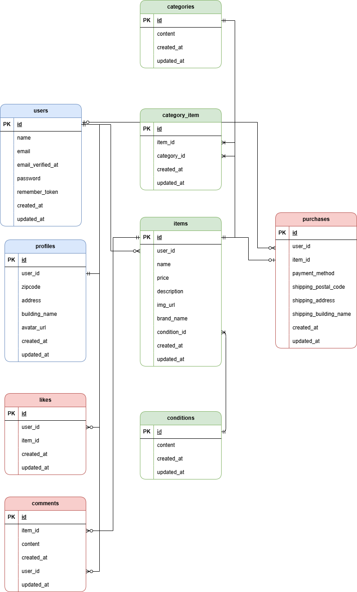

# coachtech-furima

### 概要　
COACHTECH 模擬案件：Laravel を用いたフリマアプリの作成プロジェクトです。
出品・購入・コメント・いいね機能などを実装しています。

---

### 🛠️ 環境構築手順

#### 1. リポジトリの設定

このリポジトリを clone してください。

```bash
cd coachtech/laravel
git clone https://github.com/megumi2233/coachtech-furima.git
cd coachtech-furima
```

#### 2. Docker の設定

ローカル環境に必要なサービス（nginx, php, mysql, phpMyAdmin）を Docker で構築・起動します。

事前に Docker Desktop を起動し、クジラ 🐳 アイコンが表示されていることを確認してください。

以下のコマンドで Docker 環境を構築・起動します。

```bash
docker-compose up -d --build
```

コンテナが立ち上がれば成功です。

#### 3. Laravel のパッケージのインストール

Laravel の動作に必要な依存パッケージをインストールします。

```bash
docker-compose exec php bash
composer install
exit
```

#### 4. .env ファイルの作成

Laravel の環境設定を行うために、`.env.example` をコピーして `.env` ファイルを作成します。

```bash
cp .env.example .env
```

※ .env.example を参考に新しく .env を作成しても構いません。

.env の DB 設定を以下のように修正して、DB 接続情報や APP_KEY などの環境変数を設定します。

```ini
DB_CONNECTION=mysql
DB_HOST=mysql
DB_PORT=3306
DB_DATABASE=laravel_db
DB_USERNAME=laravel_user
DB_PASSWORD=laravel_pass
```

#### 5. アプリケーションキーの生成

アプリケーションを起動するためのキーを生成します。

```bash
php artisan key:generate
```

※このコマンドは **php コンテナ内のプロジェクトルート**で実行してください。

##### php コンテナに入ってプロジェクトルートへ移動する方法

```bash
docker-compose exec php bash
cd /var/www
```

※ コンテナから抜けるときは exit を入力してください。

#### 6. マイグレーションの実行

データベースにテーブルを作成します。

このコマンドも **php コンテナ内のプロジェクトルート**で実行してください。

```bash
php artisan migrate
```

#### 7. シーディングの実行

初期データを投入します。

このコマンドも **php コンテナ内のプロジェクトルート**で実行してください。

```bash
php artisan db:seed
```

#### 8. ストレージのシンボリックリンク作成

商品画像やプロフィール画像など、ユーザーがアップロードしたファイルを公開するために、シンボリックリンクを作成します。
（※これを行わないと、出品した商品画像やプロフィール画像が表示されません）

このコマンドも **php コンテナ内のプロジェクトルート**で実行してください。

```bash
php artisan storage:link
```

---

### 🧩 View ファイルの作成

#### 共通レイアウト
- `src/resources/views/layouts/auth.blade.php`
  - 会員登録・ログイン・認証用の共通レイアウト
- `src/resources/views/layouts/app.blade.php`
  - メイン用の共通レイアウト（認証画面以外の画面）

#### 会員登録・認証関連
- `src/resources/views/auth/register.blade.php` : 会員登録画面
- `src/resources/views/auth/login.blade.php` : ログイン画面
- `src/resources/views/auth/verify.blade.php` : メール認証画面

#### 商品関連
- `src/resources/views/index.blade.php` : 商品一覧画面
- `src/resources/views/item/show.blade.php` : 商品詳細画面
- `src/resources/views/item/create.blade.php` : 商品出品画面

#### 購入関連
- `src/resources/views/purchase/show.blade.php` : 商品購入画面
- `src/resources/views/purchase/address.blade.php` : 送付先住所変更画面（※作成中）

#### マイページ・プロフィール
- `src/resources/views/mypage/profile.blade.php` : プロフィール画面
- `src/resources/views/mypage/edit.blade.php` : プロフィール編集画面

---

### 🎨 CSS ファイルの作成

#### 共通スタイル
- `src/public/css/sanitize.css` : リセットCSS
- `src/public/css/auth.css` : 会員登録・ログイン・認証用の共通スタイル
- `src/public/css/common.css` : メイン用の共通スタイル

#### 各画面専用スタイル
- **認証関連**
  - `src/public/css/register.css` : 会員登録画面
  - `src/public/css/login.css` : ログイン画面
  - `src/public/css/verify.css` : メール認証画面

- **商品関連**
  - `src/public/css/index.css` : 商品一覧画面
  - `src/public/css/item.css` : 商品詳細画面
  - `src/public/css/sell.css` : 商品出品画面

- **購入関連**
  - `src/public/css/purchase.css` : 商品購入画面
  - `src/public/css/address.css` : 送付先住所変更画面

- **マイページ関連**
  - `src/public/css/profile.css` : プロフィール画面
  - `src/public/css/profile_edit.css` : プロフィール編集画面
    
---

### 🛠 使用技術（この例で使われている環境）
- **PHP 8.2**  
- **Laravel 10.x**  
- **MySQL 8.0.x**  
- **Docker（開発環境構築）**  
  - nginx（Webサーバ）  
  - php（アプリケーション）  
  - mysql（データベース）  
  - phpmyadmin（DB管理ツール）  
- **フロントエンドビルド**: Vite（Laravel公式推奨のビルドツール）

---

### 📋 テーブル設計
#### 1. users テーブル (ユーザー情報)

| カラム名 | 型 | PK | UNIQUE | NOT NULL | FK (外部キー) |
|---|---|:---:|:---:|:---:|---|
| id | unsigned bigint | ○ | | ○ | |
| name | string | | | ○ | |
| email | string | | ○ | ○ | |
| email_verified_at | timestamp | | | | |
| password | string | | | ○ | |
| remember_token | string | | | | |
| created_at | timestamp | | | | |
| updated_at | timestamp | | | | |

#### 2. profiles テーブル (プロフィール詳細)

| カラム名 | 型 | PK | UNIQUE | NOT NULL | FK (外部キー) |
|---|---|:---:|:---:|:---:|---|
| id | unsigned bigint | ○ | | ○ | |
| user_id | unsigned bigint | | | ○ | users(id) |
| zipcode | string | | | ○ | |
| address | string | | | ○ | |
| building_name | string | | | | |
| avatar_url | text | | | | |
| created_at | timestamp | | | | |
| updated_at | timestamp | | | | |

#### 3. items テーブル (商品情報)

| カラム名 | 型 | PK | UNIQUE | NOT NULL | FK (外部キー) |
|---|---|:---:|:---:|:---:|---|
| id | unsigned bigint | ○ | | ○ | |
| user_id | unsigned bigint | | | ○ | users(id) |
| name | string | | | ○ | |
| price | integer | | | ○ | |
| description | text | | | ○ | |
| img_url | text | | | ○ | |
| brand_name | string | | | | |
| condition_id | unsigned bigint | | | ○ | conditions(id) |
| created_at | timestamp | | | | |
| updated_at | timestamp | | | | |

#### 4. categories テーブル (カテゴリー)

| カラム名 | 型 | PK | UNIQUE | NOT NULL | FK (外部キー) |
|---|---|:---:|:---:|:---:|---|
| id | unsigned bigint | ○ | | ○ | |
| content | string | | | ○ | |
| created_at | timestamp | | | | |
| updated_at | timestamp | | | | |

#### 5. conditions テーブル (商品状態)

| カラム名 | 型 | PK | UNIQUE | NOT NULL | FK (外部キー) |
|---|---|:---:|:---:|:---:|---|
| id | unsigned bigint | ○ | | ○ | |
| content | string | | | ○ | |
| created_at | timestamp | | | | |
| updated_at | timestamp | | | | |

#### 6. purchases テーブル (購入履歴)

| カラム名 | 型 | PK | UNIQUE | NOT NULL | FK (外部キー) |
|---|---|:---:|:---:|:---:|---|
| id | unsigned bigint | ○ | | ○ | |
| user_id | unsigned bigint | | | ○ | users(id) |
| item_id | unsigned bigint | | | ○ | items(id) |
| payment_method | string | | | ○ | |
| shipping_postal_code | string | | | ○ | |
| shipping_address | string | | | ○ | |
| shipping_building_name | string | | | | |
| created_at | timestamp | | | | |
| updated_at | timestamp | | | | |

#### 7. likes テーブル (いいね)

| カラム名 | 型 | PK | UNIQUE | NOT NULL | FK (外部キー) |
|---|---|:---:|:---:|:---:|---|
| id | unsigned bigint | ○ | | ○ | |
| user_id | unsigned bigint | | | ○ | users(id) |
| item_id | unsigned bigint | | | ○ | items(id) |
| created_at | timestamp | | | | |
| updated_at | timestamp | | | | |

#### 8. comments テーブル (コメント)

| カラム名 | 型 | PK | UNIQUE | NOT NULL | FK (外部キー) |
|---|---|:---:|:---:|:---:|---|
| id | unsigned bigint | ○ | | ○ | |
| item_id | unsigned bigint | | | ○ | items(id) |
| content | string | | | ○ | |
| created_at | timestamp | | | | |
| user_id | unsigned bigint | | | ○ | users(id) |
| updated_at | timestamp | | | | |

#### 9. category_item テーブル (中間テーブル)

| カラム名 | 型 | PK | UNIQUE | NOT NULL | FK (外部キー) |
|---|---|:---:|:---:|:---:|---|
| id | unsigned bigint | ○ | | ○ | |
| item_id | unsigned bigint | | | ○ | items(id) |
| category_id | unsigned bigint | | | ○ | categories(id) |
| created_at | timestamp | | | | |
| updated_at | timestamp | | | | |

---

### 🗂 ER図（このプロジェクトのデータ構造）

このアプリケーションのデータ構造を視覚的に把握するため、以下にER図を掲載しています。

この図では、`items`（商品）テーブルと `users`（ユーザー）テーブルを中心に構成されています。
ユーザーが商品を出品し、ユーザーが商品を購入するという関係性から、`users` と `items`、および `users` と `purchases` はそれぞれ「1対多」のリレーションで接続されています。
また、1つの商品に複数のカテゴリーを設定できるよう、`items` と `categories` は中間テーブル（`category_item`）を介した「多対多」の関係となっています。



※ 補足：
1. 図は draw.io（diagrams.net）にて作成し、PNG形式で保存しています。
2. 元データは `coachtech-furima-er.drawio` にて編集可能です。
3. PNGファイルは `assets/coachtech-furima-er.png` に保存されています。

   → READMEではこの画像を参照しています。
4. 編集には [draw.io（diagrams.net）](https://app.diagrams.net/) を使用してください。

　 ローカルアプリまたはブラウザ版のどちらでも編集可能です。
5. ER図の更新手順：drawioで編集 → PNG再出力 → assetsに上書き保存 → README確認
   ※GitHub上で画像が更新されない場合は、キャッシュをクリアしてください。

---

### 📦 ダミーデータについて
商品ダミーデータを作成するために、出品者となるユーザーデータ（テストユーザー）も同時に作成するように実装しました。

#### テストユーザー情報（動作確認用）

```ini
email: test@example.com
password: password123
```
※シーディング実行後、上記のアカウントでログインすることで、ダミー商品データの表示やマイページ機能などの動作確認がすぐに可能です。

---

### 🎨 デザイン・レイアウトに関する注記

**プルダウン（セレクトボックス）の表示について**
以下の画面におけるプルダウン選択時の表示について、設計書（Mac環境）では選択肢に「チェックマーク（✓）」が表示されていますが、本環境（Windows）および標準的なブラウザの仕様に準拠し、OS標準のスタイル（背景色の変化のみ）を採用しています。

* **商品出品画面：** 「商品の状態」の選択
* **商品購入画面：** 「支払い方法」の選択

※無理なスタイル変更によるスマホ等でのレイアウト崩れを防ぐため、HTML標準の `<select>` タグの挙動を優先しています。

